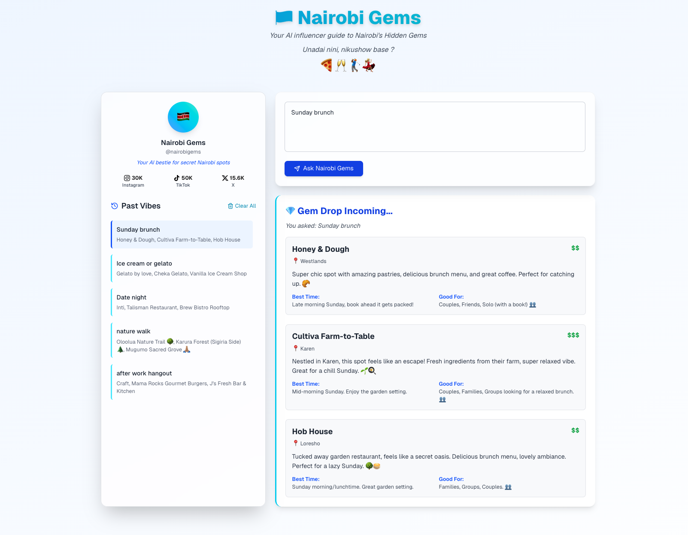
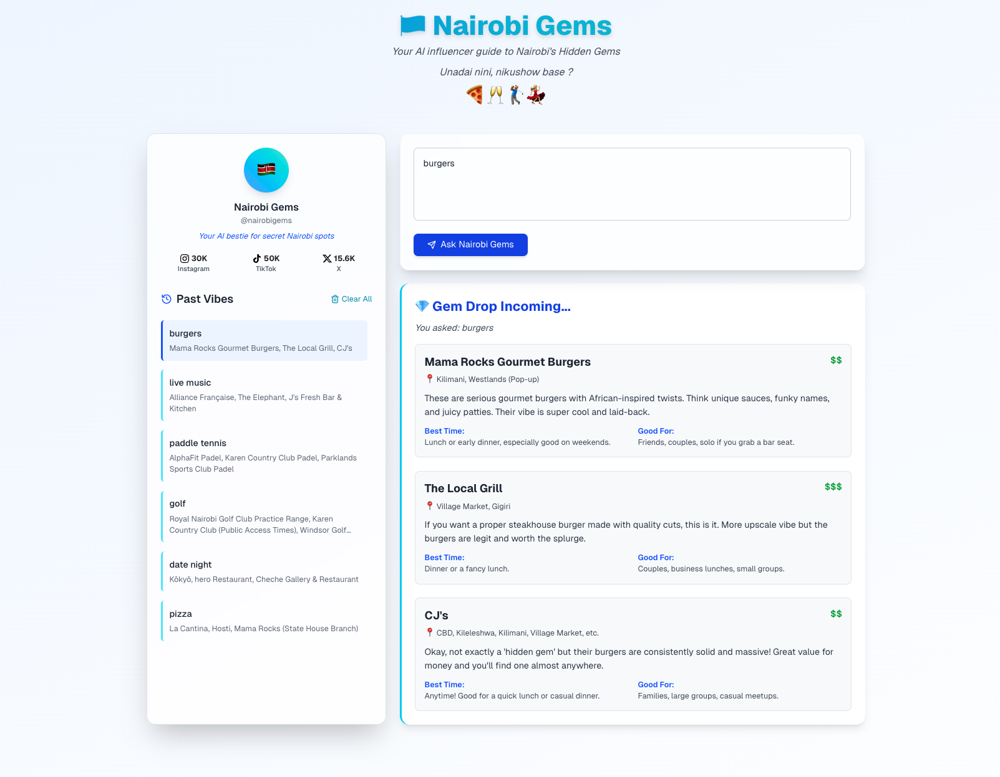

### 🇰🇪Nairobi Gems Frontend 
Your AI influencer to Nairobi's Hidden Gems

An AI-powered web application that helps users discover hidden gems in Nairobi, including restaurants, entertainment spots, and local experiences.

This repo is just for the frontend. It is designed to be used with a backend application that receives requests on the `/webhook` endpoint. 

The backend repo and instruction on how to install can be found here - https://github.com/maimbaM/nairobi-gems-backend.git

The whole application is deployed and can be found here  - https://main.d34he85m4y34lf.amplifyapp.com/




## Features

- 🤖 AI-powered recommendations for Nairobi's hidden spots
- 💬 Interactive chat interface
- 📍 Detailed location information including budget, best times, and recommendations
- 🗂 Query history management - using Local Storage
- 💫 Modern, responsive UI 

## Tech Stack

- Next.js (React framework)
- TypeScript
- Tailwind CSS
- AWS Amplify for deployment


## Setup Instructions

### Prerequisites
- Node.js (v18 or later)
- npm (Node Package Manager)
- Docker (optional)
- Backend is already set up and running
  -The backend repo and instruction on how to install can be found here - https://github.com/maimbaM/nairobi-gems-backend.git


### Options
### Using Docker (recommended)
Ensure Docker is installed

1. Clone the repository:
```bash
# Clone the repository
git clone https://github.com/maimbaM/llm-chat-ui.git
cd llm-chat-ui
```
2. Set up environment variables:
   - Create a `.env.local` file 
   - Modify the `.env.local` file with your `NEXT_PUBLIC_WEBHOOK_URL` pointing to your backend's webhook endpoint.
   - Example `.env.local` file:
   ```plaintext
   NEXT_PUBLIC_WEBHOOK_URL=http://localhost:8000/webhook
   ```
3. Build the project
```bash
docker-compose up --build
```
4. Access the API at `http://localhost:3000`.

### Local Development

1. Clone the repository:
```bash
# Clone the repository
git clone https://github.com/maimbaM/llm-chat-ui.git
cd llm-chat-ui
```
2. Set up environment variables:
   - Create a `.env.local` file 
   - Modify the `.env.local` file with your `NEXT_PUBLIC_WEBHOOK_URL` pointing to your backend's webhook endpoint.
   - Example `.env.local` file:
   ```plaintext
   NEXT_PUBLIC_WEBHOOK_URL=http://localhost:8000/webhook
   ```
3. Install dependencies:
```bash
npm install
```
4. Start the development server:
```bash
npm run dev
```
5. Access the application at `http://localhost:3000`.


## Deployment
The application is deployed using AWS Amplify and its can set it up by connecting your GitHub repository to AWS Amplify.
On each commit to the main branch, the application will automatically build and deploy.

## Usage
Accepts questions and returns AI-generated recommendations. 

Keeps a history of previous asked questions

Question examples
1. Pizza places
2. Karaoke in Westlands
3. Sunday brunch spots
4. nature walks

Responses

Returns a list of 3 places to visit in Nairobi based on the question asked. Each place includes:
- `name`: Name of the place
- `location`: General area or neighborhood
- `budget`: Estimated budget (e.g., $, $$, $$$)
- `description`: A brief description of the place
- `best_time`: Best time to visit
- `good_for`: Who the place is suitable for (e.g., solo, couples, families, groups)




### Improvements
1. Add authentication